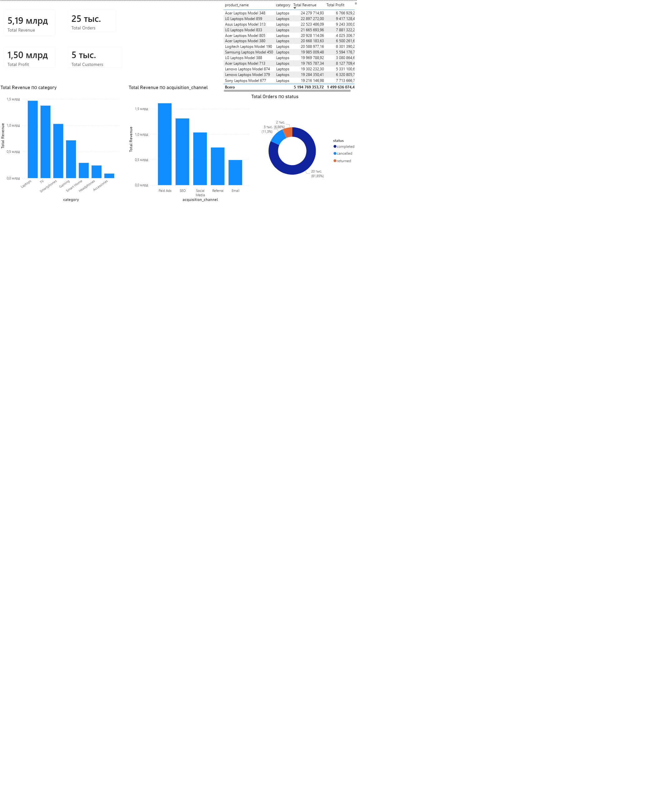

# ElectroMarket Analytics

## Project Overview

ElectroMarket Analytics is an end-to-end data analytics project for a fictional electronics marketplace.

The goal of the project is to analyze sales, customer behavior, product performance, marketing channels and customer retention.

## Business Problem

The marketplace wants to understand:

- which product categories generate the most revenue;
- which customers are the most valuable;
- which acquisition channels bring loyal users;
- what share of customers returns after the first purchase;
- which customer segments are at risk of churn.

## Tools Used

- Python
- pandas
- SQLite
- SQL
- matplotlib
- seaborn
- Jupyter Notebook
- GitHub

## Dataset

The dataset was generated using Python and contains the following tables:

- customers
- products
- orders
- order_items
- sessions
- reviews

## Repository Structure

```text
data/
scripts/
sql/
reports/
dashboard/
images/
README.md
requirements.txt
```

## Key Metrics

The project analyzes the following metrics:

- Revenue
- Profit
- Average Order Value
- Repeat Purchase Rate
- Cancellation Rate
- Return Rate
- Conversion Rate
- Customer Segments

## Analysis Steps

1. Data generation
2. Data cleaning
3. SQL analysis
4. Exploratory data analysis
5. RFM customer segmentation
6. Business recommendations

## Key Insights

- Smartphones and Laptops generated the highest revenue.
- Referral and Email customers demonstrated stronger loyalty.
- Paid Ads generated many first-time customers but weaker retention.
- RFM analysis helped identify Champions, Loyal Customers, At Risk and Lost Customers.
- Retention campaigns should focus on At Risk customers.

## How to Run the Project

Clone the repository:

```bash
git clone https://github.com/htlaets/electromarket-analytics.git
```

Open the project folder:

```bash
cd electromarket-analytics
```

Install dependencies:

```bash
pip install -r requirements.txt
```

Generate the dataset:

```bash
python scripts/generate_data.py
```

Run SQL analysis:

```bash
python scripts/run_sql_analysis.py
```

## Project Results

As a result of the analysis, the project identifies the most profitable product categories, evaluates marketing channel performance and segments customers based on purchasing behavior.

## Dashboard Preview



## Author

htlaets  
Data Analyst Portfolio Project