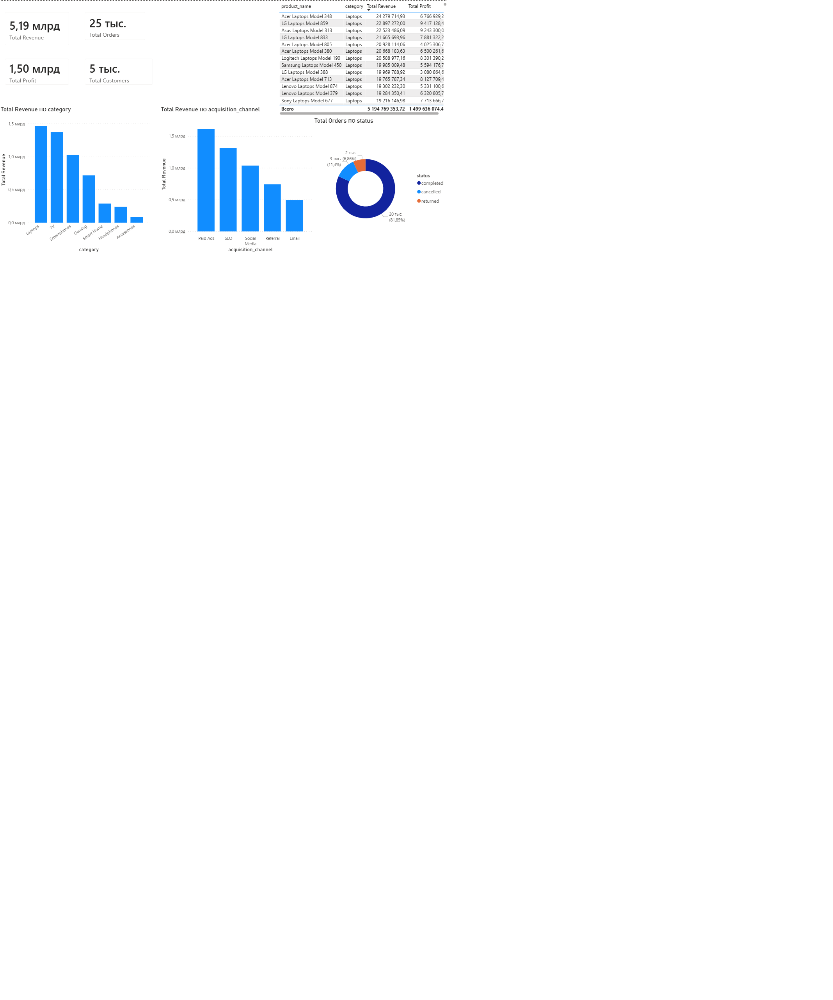

# ElectroMarket Analytics

## Описание проекта

ElectroMarket Analytics — проект по анализу данных интернет-магазина электроники.

Цель проекта — исследование продаж, поведения клиентов, эффективности маркетинговых каналов и удержания покупателей с использованием Python и SQL.

## Цель исследования

В рамках проекта проведен анализ, позволяющий ответить на следующие вопросы:

- какие категории товаров приносят наибольшую выручку;
- какие клиенты являются наиболее ценными;
- какие каналы привлечения наиболее эффективны;
- какова доля повторных покупок;
- какие группы клиентов находятся в зоне риска оттока.

## Используемые технологии

- Python
- pandas
- SQLite
- SQL
- matplotlib
- seaborn
- Jupyter Notebook
- Git

## Используемые данные

Для проекта был сформирован набор данных, включающий следующие таблицы:

- customers — информация о клиентах;
- products — информация о товарах;
- orders — заказы;
- order_items — состав заказов;
- sessions — посещения сайта;
- reviews — отзывы покупателей.

## Структура проекта

```text
data/
scripts/
sql/
reports/
dashboard/
images/
README.md
requirements.txt
```

## Основные метрики

В ходе анализа рассчитывались следующие показатели:

- выручка;
- прибыль;
- средний чек;
- доля повторных покупок;
- коэффициент отмен заказов;
- коэффициент возвратов;
- конверсия;
- сегментация клиентов.

## Этапы выполнения проекта

1. Генерация набора данных.
2. Предварительная обработка данных.
3. Анализ данных с помощью SQL.
4. Исследовательский анализ данных (EDA).
5. RFM-сегментация клиентов.
6. Подготовка выводов и рекомендаций.

## Основные результаты

По итогам анализа были получены следующие выводы:

- наибольшую выручку принесли категории «Смартфоны» и «Ноутбуки»;
- клиенты, пришедшие по рекомендациям и через e-mail-рассылку, чаще совершают повторные покупки;
- платная реклама привлекает большое количество новых пользователей, однако уровень их удержания ниже;
- RFM-анализ позволил выделить наиболее ценных клиентов, постоянных покупателей, клиентов с риском оттока и потерянных клиентов;
- для повышения удержания рекомендуется уделить внимание клиентам из группы риска.

## Запуск проекта

Клонировать репозиторий:

```bash
git clone https://github.com/htlaets/electromarket-analytics.git
```

Перейти в каталог проекта:

```bash
cd electromarket-analytics
```

Установить необходимые зависимости:

```bash
pip install -r requirements.txt
```

Сгенерировать данные:

```bash
python scripts/generate_data.py
```

Выполнить SQL-анализ:

```bash
python scripts/run_sql_analysis.py
```

## Итоги

Проект демонстрирует полный цикл анализа данных: подготовку данных, выполнение SQL-запросов, исследовательский анализ, сегментацию клиентов методом RFM и формирование рекомендаций на основе полученных результатов.

## Пример дашборда



## Автор

**htlaets**

Учебный проект по анализу данных.
